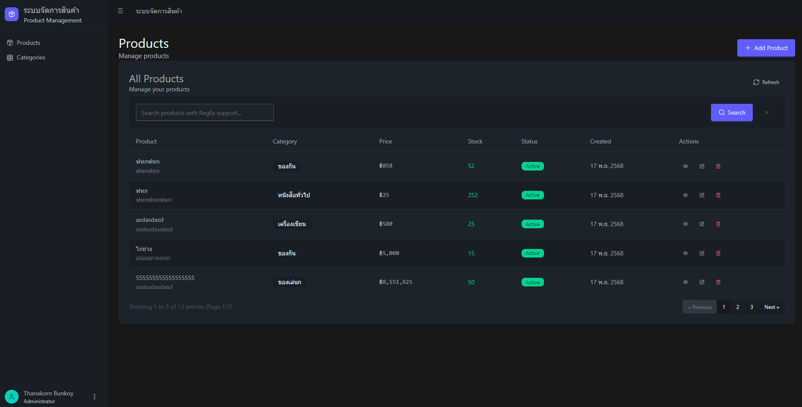
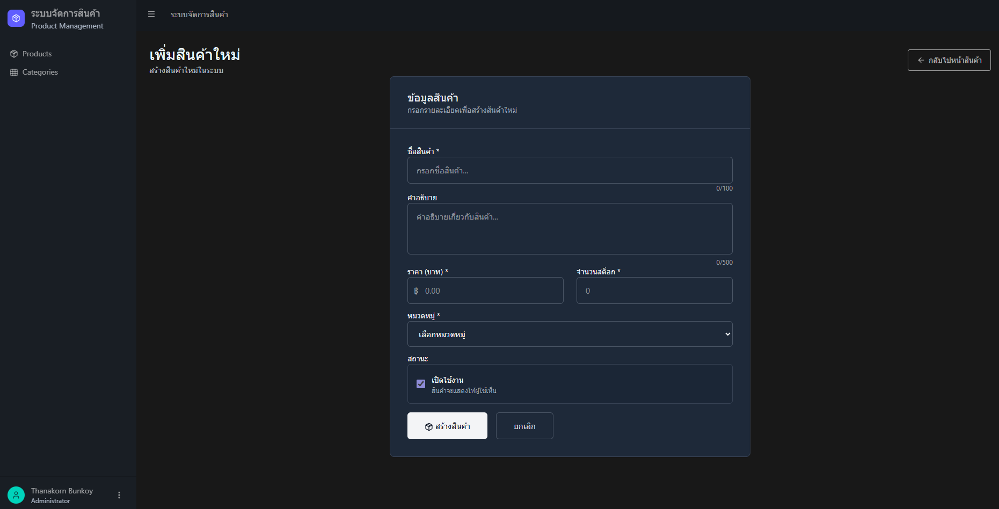
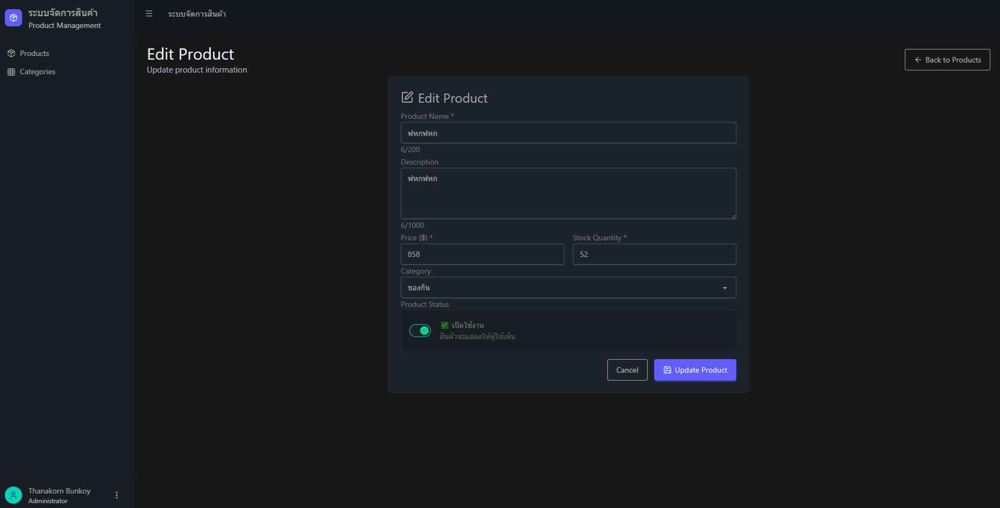
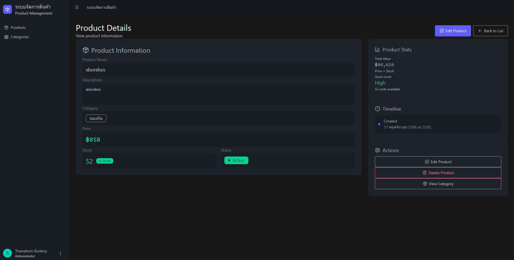
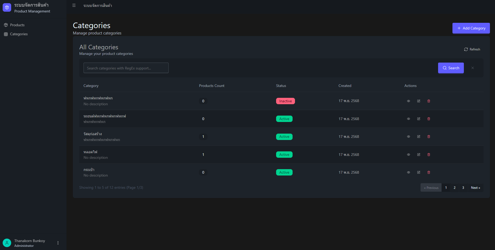
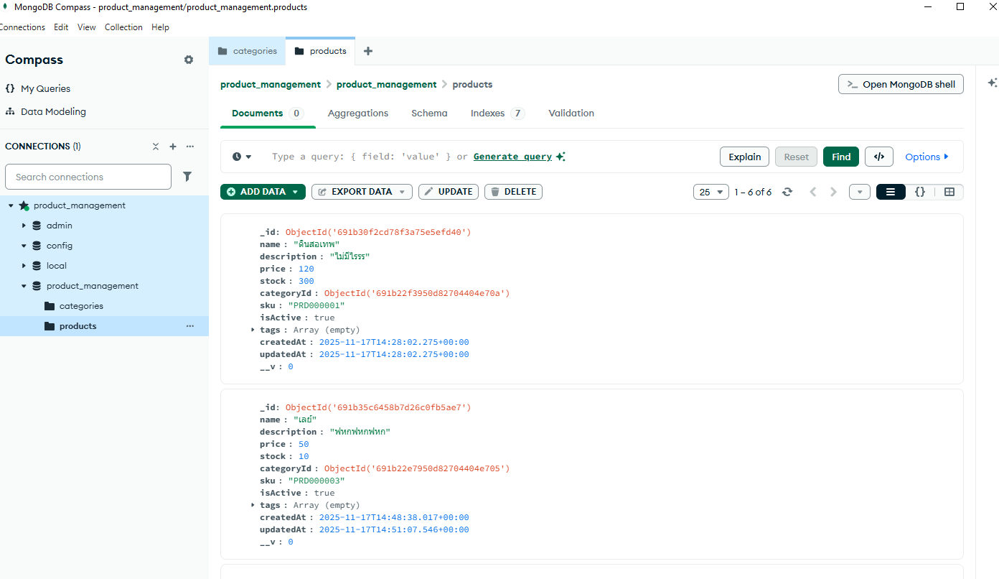

# 📦 Product Management System

ระบบจัดการสินค้าและหมวดหมู่สินค้า (Product & Category Management) พัฒนาด้วย **Vue.js** และ **Node.js**

## 🛠️ Technology Stack

### Frontend
- **Vue.js 3** - JavaScript Framework
- **Vue Router** - การจัดการหน้าเว็บ
- **DaisyUI + Tailwind CSS** - UI Components และ Styling
- **Lucide Vue Next** - Icons
- **Vite** - Build Tool

### Backend
- **Node.js** - Runtime Environment
- **Express.js** - Web Framework
- **MongoDB** - NoSQL Database
- **Mongoose** - MongoDB ODM
- **Express Validator** - Data Validation

## 🚀 Features

### ✨ Frontend Features
- 📋 **ตารางแสดงข้อมูล**: สินค้าและหมวดหมู่แบบ responsive
- 🔍 **การค้นหา**: รองรับ Regular Expression (RegEx)
- 📄 **Pagination**: แบ่งหน้าข้อมูล
- ➕ **เพิ่มข้อมูล**: ฟอร์มสร้างสินค้าและหมวดหมู่
- ✏️ **แก้ไขข้อมูล**: แก้ไขสินค้าและหมวดหมู่
- 🗑️ **ลบข้อมูล**: Soft Delete และ Hard Delete
- 👁️ **ดูรายละเอียด**: หน้า Preview ข้อมูลแบบละเอียด
- ✅ **Validation**: ตรวจสอบข้อมูลก่อนบันทึก
- 📱 **Responsive Design**: ใช้งานได้ทุกอุปกรณ์

### 🔧 Backend Features
- 🌐 **RESTful API**: มาตรฐาน REST API
- 🔍 **Search & Filter**: ค้นหาด้วย RegEx
- 📄 **Pagination**: แบ่งหน้าข้อมูล
- 🗃️ **Database Relations**: Product เชื่อมโยง Category
- ✅ **Data Validation**: ตรวจสอบข้อมูลที่ API
- 🛡️ **Error Handling**: จัดการ Error แบบครบถ้วน
- 🗑️ **Soft/Hard Delete**: เลือกประเภทการลบได้

## 📁 Project Structure

```
product-management-exam/
├── frontend/                 # Vue.js Application
│   ├── src/
│   │   ├── views/           # หน้าเว็บต่างๆ
│   │   ├── services/        # API Services
│   │   ├── router/          # Vue Router Configuration
│   │   └── App.vue          # Main App Component
│   ├── package.json
│   └── vite.config.js
│
├── backend/                  # Node.js API Server
│   ├── src/
│   │   ├── controllers/     # Business Logic
│   │   ├── models/          # Database Models
│   │   ├── routes/          # API Routes
│   │   ├── middleware/      # Validation & Error Handling
│   │   ├── services/        # Database Services
│   │   └── app.js          # Main Server File
│   ├── package.json
│   └── .env                 # Environment Variables
│
├── README.md
└── spec.md                  # Project Requirements
```

## 🔧 Installation & Setup

### Prerequisites (ข้อกำหนดเบื้องต้น)
- **Node.js** (v16 หรือสูงกว่า) - [Download here](https://nodejs.org/)
- **MongoDB** (v5 หรือสูงกว่า) - [Download here](https://www.mongodb.com/try/download/community)
- **Git** - [Download here](https://git-scm.com/)

### 1. Clone Repository
```bash
git clone <repository-url>
cd product-management-exam
```

### 2. Setup Backend (API Server)

```bash
# เข้าไปใน folder backend
cd backend

# ติดตั้ง dependencies
npm install

# สร้างไฟล์ .env (ถ้ายังไม่มี)
# คัดลอกจาก .env.example หรือสร้างใหม่
```

**สร้างไฟล์ `.env` ใน folder backend:**
```env
# Database
MONGODB_URI=mongodb://localhost:27017/product_management

# Server
PORT=3000
NODE_ENV=development

# API
API_VERSION=v1
```

**เริ่มต้น MongoDB:**
```bash
# Windows (ถ้าติดตั้งเป็น Service)
net start MongoDB

# หรือถ้าติดตั้งแบบ Standalone
mongod
```

**รัน Backend Server:**
```bash
npm start
# หรือ
node src/app.js
```

**ตรวจสอบว่า Backend ทำงาน:**
- เปิดเบราว์เซอร์ไป `http://localhost:3000`
- ควรเห็นข้อความ "Product Management API is running"

### 3. Setup Frontend (Web Application)

**เปิด Terminal ใหม่:**
```bash
# เข้าไปใน folder frontend
cd frontend

# ติดตั้ง dependencies
npm install

# รัน Development Server
npm run dev
```

**เข้าใช้งานเว็บไซต์:**
- เปิดเบราว์เซอร์ไป `http://localhost:5173`
- ควรเห็นหน้าเว็บระบบจัดการสินค้า

## 🎯 API Endpoints

### Products API
| Method | Endpoint | Description |
|--------|----------|-------------|
| GET | `/api/v1/products` | ดึงรายการสินค้าทั้งหมด (มี pagination) |
| GET | `/api/v1/product/:id` | ดึงข้อมูลสินค้าตาม ID |
| POST | `/api/v1/product` | สร้างสินค้าใหม่ |
| PUT | `/api/v1/product/:id` | แก้ไขข้อมูลสินค้า |
| DELETE | `/api/v1/product/:id` | ลบสินค้า |

### Categories API
| Method | Endpoint | Description |
|--------|----------|-------------|
| GET | `/api/v1/categories` | ดึงรายการหมวดหมู่ทั้งหมด (มี pagination) |
| GET | `/api/v1/category/:id` | ดึงข้อมูลหมวดหมู่ตาม ID |
| POST | `/api/v1/category` | สร้างหมวดหมู่ใหม่ |
| PUT | `/api/v1/category/:id` | แก้ไขข้อมูลหมวดหมู่ |
| DELETE | `/api/v1/category/:id` | ลบหมวดหมู่ |

### Query Parameters สำหรับการค้นหา
```
GET /api/v1/products?page=1&limit=10&search=iPhone
GET /api/v1/categories?page=1&limit=5&search=^Electronics
```

## 📝 Usage Examples

### การใช้งานพื้นฐาน

1. **เพิ่มหมวดหมู่ก่อน**:
   - ไปที่เมนู "Categories" → กดปุ่ม "Add Category"
   - กรอกชื่อหมวดหมู่ เช่น "อิเล็กทรอนิกส์"
   - กดบันทึก

2. **เพิ่มสินค้า**:
   - ไปที่เมนู "Products" → กดปุ่ม "Add Product"
   - กรอกข้อมูลสินค้า และเลือกหมวดหมู่
   - กดบันทึก

3. **ค้นหาสินค้า**:
   - ใช้ช่องค้นหาบนตาราง
   - รองรับ RegEx เช่น: `^iPhone` (ขึ้นต้นด้วย iPhone)

### การใช้ RegEx Search

```
^iPhone        # ขึ้นต้นด้วย "iPhone"
Samsung$       # ลงท้ายด้วย "Samsung"  
.*phone.*      # มีคำว่า "phone" อยู่ข้างใน
(Apple|Google) # มีคำว่า "Apple" หรือ "Google"
```

## Database Structure

The application uses MongoDB as its database. Below is an overview of the collections and their fields:

### Collections

1. **Products**
   - `name` (String): The name of the product.
   - `description` (String): A brief description of the product.
   - `price` (Number): The price of the product.
   - `stock` (Number): The available stock quantity.
   - `categoryId` (ObjectId): The ID of the category the product belongs to.
   - `isActive` (Boolean): Indicates whether the product is active.

2. **Categories**
   - `name` (String): The name of the category.
   - `description` (String): A brief description of the category.
   - `isActive` (Boolean): Indicates whether the category is active.

### Example Image








